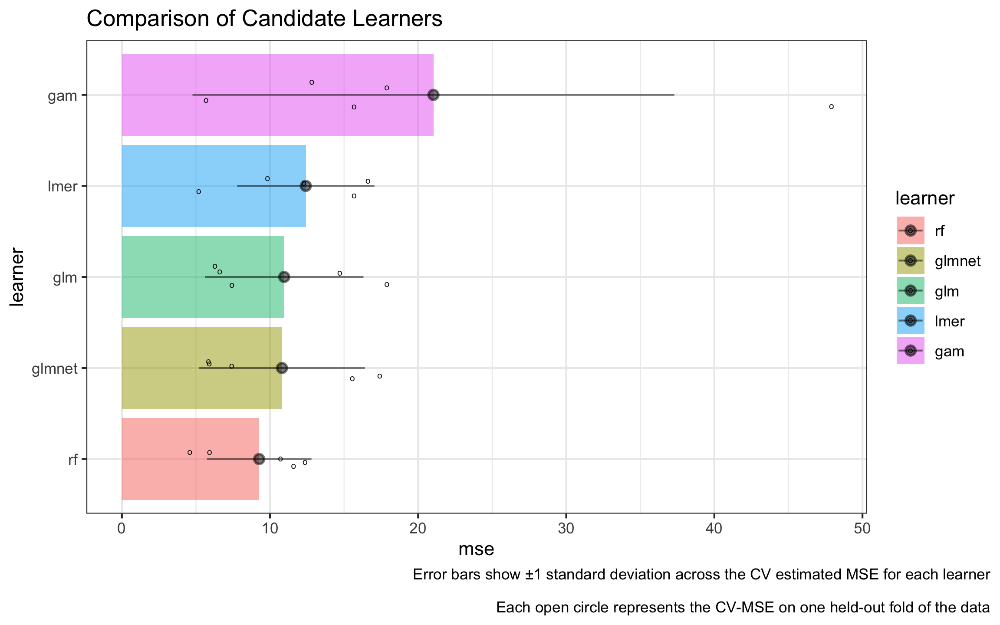
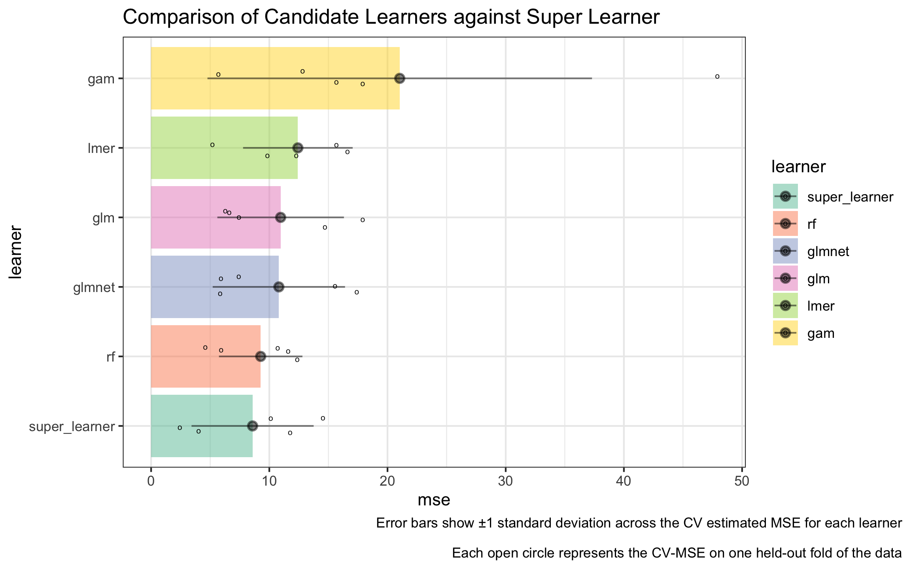

# `{nadir}` 

*nadir* (noun): nā-dir

  > the lowest point. 
  
Fitting with the *minimum loss based estimation*[^3][^4] literature, `{nadir}` is an
implementation of the super learner algorithm with improved support for flexible
formula based syntax and which is fond of functional programming techniques such as closures, currying, and function factories. 

[^3]: van der Laan, Mark J. and Dudoit, Sandrine, "Unified Cross-Validation Methodology For Selection Among Estimators and a General Cross-Validated Adaptive Epsilon-Net Estimator: Finite Sample Oracle Inequalities and Examples" (November 2003). U.C. Berkeley Division of Biostatistics Working Paper Series. Working Paper 130.
https://biostats.bepress.com/ucbbiostat/paper130

[^4]: Zheng, W., & van der Laan, M. J. (2011). Cross-Validated Targeted Minimum-Loss-Based Estimation. In Springer Series in Statistics (pp. 459–474). Springer New York. https://doi.org/10.1007/978-1-4419-9782-1_27 

--- 

`{nadir}` implements the super learner algorithm[^1]. To quote *the Guide to SuperLearner*[^2] (a previous implementation): 

> SuperLearner is an algorithm that uses cross-validation to estimate the performance of multiple machine learning models, or the same model with different settings. It then creates an optimal weighted average of those models, aka an “ensemble”, using the test data performance. This approach has been proven to be asymptotically as accurate as the best possible prediction algorithm that is tested.


## Why `{nadir}` and why reimplement super learner again? 

In previous implementations ([`{SuperLearner}`](https://github.com/ecpolley/SuperLearner), 
[`{sl3}`](https://github.com/tlverse/sl3/), [`{mlr3superlearner}`](https://cran.r-project.org/web/packages/mlr3superlearner/mlr3superlearner.pdf)), support for *flexible formula-based syntax* has been limited, 
instead opting for specifying learners as models on an $X$ matrix and $Y$ outcome vector. 
Many popular R packages such as `lme4` and `mgcv` (for random effects and 
generalized additive models) use formulas extensively to specify models
using syntax like `(age | strata)` to specify random effects on age by strata, or 
`s(age, income)` to specify a smoothing term on `age` and `income` simultaneously. 

At present, it is difficult to use these kinds of features in `{SuperLearner}`, `{sl3}` and `{ml3superlearner}`. 

For example, it is easy to imagine the super learner algorithm being appealing
to modelers fond of random effects based models because they may want to hedge
on the exact nature of the random effects models, not sure if random intercepts
are enough or if random slopes should be included, etc., and similar other
modeling decisions in other frameworks.

Therefore, the `{nadir}` package takes as its charges to: 

  * Implement a syntax in which it is easy to specify *different formulas* for each of 
  many candidate learners. 
  * To make it easy to pass new learners to the Super Learner algorithm. 

[^1]: van der Laan, M. J., Polley, E. C., & Hubbard, A. E. (2007). Super Learner. In Statistical Applications in Genetics and Molecular Biology (Vol. 6, Issue 1). Walter de Gruyter GmbH. https://doi.org/10.2202/1544-6115.1309  <https://pubmed.ncbi.nlm.nih.gov/17910531/> 
[^2]: Guide to `{SuperLearner}`: <https://cran.r-project.org/web/packages/SuperLearner/vignettes/Guide-to-SuperLearner.html>

# Installation Instructions

At present, `{nadir}` is only available on GitHub. 

```r
devtools::install_github("ctesta01/nadir")
```

<b><i>Warning: this package is currently under active development and 
may be wrong!</i> Do not use this for serious applications until
this message has been removed, likely at the time of a future 
release.</b>


# Demonstration 

First, let's start with the simplest possible use case of 
`nadir::super_learner()`, which is where the user would like to 
feed in data, a specification for some regression formula(s),
specify a library of learners, 
and get back a prediction function that is suitable for plugging into 
downstream analyses, like in Targeted Learning or for pure-prediction
applications. 

Here is a demo of an extremely simple application of using `nadir::super_learner`:

```{r, echo=FALSE}
set.seed(1413)
```

```{r}
library(nadir)

# we'll use a few basic learners
learners <- list(
     glm = lnr_glm,
     rf = lnr_rf,
     glmnet = lnr_glmnet
  )
# more learners are available, see ?learners

sl_model <- super_learner(
  data = mtcars,
  formula = mpg ~ cyl + hp + disp,
  learners = learners)

# the output from super_learner is a prediction function:
# here we are producing predictions based on a weighted combination of the
# trained learners. 
sl_model(mtcars) |> head()
```

### One Step Up: Fancy Formula Features

Continuing with our `mtcars` example, suppose the user
would really like to use random effects or similar types of 
fancy formula language features. One easy way to do so with `nadir::super_learner`
is using the following syntax:

```{r}
learners <- list(
     glm = lnr_glm,
     rf = lnr_rf,
     glmnet = lnr_glmnet,
     lmer = lnr_lmer,
     gam = lnr_gam
  )

formulas <- c(
  .default = mpg ~ cyl + hp + disp,   # our first three learners use same formula
  lmer = mpg ~ (1 | cyl) + hp + disp, # both lme4::lmer and mgcv::gam have 
  gam = mpg ~ s(hp) + cyl + disp      # specialized formula syntax
  )

# fit a super_learner
sl_model <- super_learner(
  data = mtcars,
  formulas = formulas,
  learners = learners)
  
sl_model(mtcars) |> head()
```

### How should we assess performance of `nadir::super_learner()`? 

To put the learners and the super learner algorithm 
on a level playing field, it's important that 
learners and super learner both be evaluated on *held-out 
validation/test data* that the algorithms have not seen before. 

Using the `verbose = TRUE` output from `nadir::super_learner()`, 
we can call `compare_learners()` to see the mean-squared-error
(MSE) on the held-out data, also called CV-MSE, for each of the 
candidate learners specified.

```{r}
# construct our super learner with verbose = TRUE
sl_model <- super_learner(
  data = mtcars,
  formulas = formulas,
  learners = learners,
  verbose = TRUE)
  
compare_learners(sl_model)
```

<details>
<summary>Plotting code</summary>
<!-- The reason for fig-show: hide is so that the figure can be outside the details dropdown --> 
```{r}
#| fig-width: 8
#| fig-height: 5
#| fig-dpi: 300
#| fig-retina: 3
#| fig-show: show
pacman::p_load('dplyr', 'ggplot2', 'tidyr', 'magrittr')

truth <- sl_model$holdout_predictions$mpg

holdout_var <- sl_model$holdout_predictions |>
  dplyr::group_by(.sl_fold) |> 
  dplyr::summarize(across(everything(), ~ mean((. - mpg)^2))) |> 
  dplyr::summarize(across(everything(), var)) |> 
  select(-mpg, -.sl_fold) |> 
  t() |> 
  as.data.frame() |> 
  tibble::rownames_to_column('learner') |> 
  dplyr::rename(var = V1) |>
  dplyr::mutate(sd = sqrt(var))


jitters <- sl_model$holdout_predictions |> 
  dplyr::mutate(dplyr::across(-.sl_fold, ~ (. - mpg)^2)) |> 
  dplyr::select(-mpg) %>%
  tidyr::pivot_longer(cols = 2:ncol(.), names_to = 'learner', values_to = 'squared_error') |>
  dplyr::group_by(learner, .sl_fold) |> 
  dplyr::summarize(mse = mean(squared_error)) |> 
  ungroup() |> 
  rename(fold = .sl_fold)

learner_comparison_df <- sl_model |> 
  compare_learners() |> 
  t() |> 
  as.data.frame() |>
  tibble::rownames_to_column(var = 'learner') |> 
  dplyr::mutate(learner = factor(learner)) |>
  dplyr::rename(mse = V1) |>
  dplyr::left_join(holdout_var) |> 
  dplyr::mutate(
    upper_ci = mse + sd,
    lower_ci = mse - sd) |> 
  dplyr::mutate(learner = forcats::fct_reorder(learner, mse))

jitters$learner <- factor(jitters$learner, levels = levels(learner_comparison_df$learner))

learner_comparison_df |> 
  ggplot2::ggplot(ggplot2::aes(y = learner, x = mse, fill = learner)) + 
  ggplot2::geom_col(alpha = 0.5) + 
  ggplot2::geom_jitter(data = jitters, mapping = ggplot2::aes(x = mse), height = .15, shape = 'o') + 
  ggplot2::geom_pointrange(mapping = ggplot2::aes(xmax = upper_ci, xmin = lower_ci),
                           alpha = 0.5) + 
  ggplot2::theme_bw() + 
  ggplot2::ggtitle("Comparison of Candidate Learners") + 
  ggplot2::labs(caption = "Error bars show ±1 standard deviation across the CV estimated MSE for each learner\n
Each open circle represents the hold-out MSE of one fold of the data") + 
  ggplot2::theme(plot.caption.position = 'plot')
```
</details>



Now how should we go about getting the CV-MSE from a super learned
model? We will use the `cv_super_learner()` function that 
performs another layer of cross-validation in order to 
assess the specified super learner on folds of held-out data. 

If you'd like to read more about how the internals of `cv_super_learner()` 
work, please refer to the article <b>[Currying, Closures, and Function Factories](https://ctesta01.github.io/nadir/articles/currying_closures_and_function_factories.html)</b> article</i>

```{r}
#| warning: false
#| message: false

cv_results <- cv_super_learner(
  data = mtcars,
  formulas = formulas,
  learners = learners)

cv_results
```

<details>
<summary>Plotting code</summary>
<!-- The reason for fig-show: hide is so that the figure can be outside the details dropdown --> 
```{r}
#| fig-width: 8
#| fig-height: 5
#| fig-retina: 3
#| fig-show: show
cv_jitters <- cv_results$cv_trained_learners |> 
  dplyr::select(split, predictions, mpg) |> 
  tidyr::unnest(cols = c('predictions', 'mpg')) |> 
  dplyr::group_by(split) |> 
  dplyr::summarize(mse = mean((mpg - predictions)^2)) |>
  dplyr::bind_cols(learner = 'super_learner')


cv_var <- cv_results$cv_trained_learners |> 
  dplyr::select(split, predictions, mpg) |> 
  tidyr::unnest(cols = c(predictions, mpg)) |> 
  dplyr::mutate(squared_error = (mpg - predictions)^2) |> 
  dplyr::group_by(split) |> 
  dplyr::summarize(mse = mean(squared_error)) |> 
  dplyr::summarize(
    var = var(mse),
    mse = mean(mse),
    sd = sqrt(var),
    upper_ci = mse + sd,
    lower_ci = mse - sd) |> 
  dplyr::bind_cols(learner = 'super_learner')

new_jitters <- bind_rows(jitters, cv_jitters)

learner_comparison_df |> 
  bind_rows(cv_var) |> 
  dplyr::mutate(learner = forcats::fct_reorder(learner, mse)) |> 
  ggplot2::ggplot(ggplot2::aes(y = learner, x = mse, fill = learner)) + 
  ggplot2::geom_col(alpha = 0.5) + 
  ggplot2::geom_jitter(data = new_jitters, mapping = ggplot2::aes(x = mse), height = .15, shape = 'o') + 
  ggplot2::geom_pointrange(mapping = ggplot2::aes(xmax = upper_ci, xmin = lower_ci),
                           alpha = 0.5) + 
  ggplot2::theme_bw() + 
  ggplot2::scale_fill_brewer(palette = 'Set2') + 
  ggplot2::ggtitle("Comparison of Candidate Learners against Super Learner") + 
  ggplot2::labs(caption = "Error bars show ±1 standard deviation across the CV estimated MSE for each learner\n
Each open circle represents the hold-out MSE of one fold of the data") + 
  ggplot2::theme(plot.caption.position = 'plot')
```
</details>




### What about model hyperparameters or extra arguments? 

Model hyperparameters are easy to handle in `{nadir}`. 
Two easy solutions are available to users: 

  * `nadir::super_learner()` has an `extra_learner_args` parameter 
  that can be passed a list of extra arguments for each learner. 
  * Users can always build new learners (which allows for building in the hyperparameter specification), and using the `...` syntax, it's easy to 
  build new learners from the learners already provided by `{nadir}`. 

Here's some examples showing each approach.

#### Using `extra_learner_args`: 
```{r}
#| warning: false
# when using extra_learner_args, it's totally okay to use the 
# same learner multiple times as long as their hyperparameters differ.

sl_model <- nadir::super_learner(
  data = mtcars,
  formula = mpg ~ .,
  learners = c(
    glmnet0 = lnr_glmnet,
    glmnet1 = lnr_glmnet,
    glmnet2 = lnr_glmnet,
    rf0 = lnr_rf,
    rf1 = lnr_rf,
    rf2 = lnr_rf
    ),
  extra_learner_args = list(
    glmnet0 = list(lambda = 0.01),
    glmnet1 = list(lambda = 0.1),
    glmnet2 = list(lambda = 1),
    rf0 = list(ntree = 3),
    rf1 = list(ntree = 10),
    rf2 = list(ntree = 30)
    ),
  verbose = TRUE
)

compare_learners(sl_model)
```

#### Building New Learners Programmatically

When does it make more sense to build new learners
with the hyperparameters built into them rather than 
using the `extra_learner_args` parameter? 

One instance when building new learners may make sense 
is when the user would like to produce a large number of 
hyperparameterized learners programmatically, for example
over a grid of hyperparameter values.  Below we show 
such an example for a 1-d grid of hyperparameters with
`glmnet`. 

```{r}
#| warning: false
# produce a "grid" of glmnet learners with lambda set to 
# exp(-1 to 1 in steps of .1)
hyperparameterized_learners <- lapply(
  exp(seq(-1, 1, by = .1)), 
  function(lambda) { 
    return(
      function(data, formula, ...) {
        lnr_glmnet(data, formula, lambda = lambda, ...)
        })
  })
  
# give them names because nadir::super_learner requires that the 
# learners argument be named.
names(hyperparameterized_learners) <- paste0('glmnet', 1:length(hyperparameterized_learners))

# fit the super_learner with 20 glmnets with different lambdas
sl_model_glmnet <- nadir::super_learner(
  data = mtcars,
  learners = hyperparameterized_learners,
  formula = mpg ~ .,
  verbose = TRUE)

compare_learners(sl_model_glmnet)
```

# What are currying, closures, and function factories? 

`R` is a functional programming language, which allows for functions to 
build and return functions just like any other return object. 

We refer to functions that create and return another function as a 
_function factory_. For an extended reference, see [the Advanced R book](https://adv-r.hadley.nz/function-factories.html). 

Function factories are so useful in `{nadir}` because, at their essence, 
a candidate learner needs to be able to 1) accept training data, and 2) 
produce a prediction function that can make predictions on heldout
validation data. So a typical learner in `{nadir}` looks like:

```r
lnr_lm <- function(data, formula, ...) {
  model <- stats::lm(formula = formula, data = data, ...)

  predict_from_trained_lm <- function(newdata) {
    predict(model, newdata = newdata, type = 'response')
  }
  return(predict_from_trained_lm)
}
```

Moreover, given how code-lightweight it is to write a simple learner, this makes 
it relatively easy for users to write new learners that meet their exact needs. 

If you want to implement your own learners, you just need to follow the 
following pseudocode approach: 

```r
lnr_custom <- function(data, formula, ...) {
  model <- # train your model using data, formula, ... 
  
  predict_from_model <- function(newdata) {
    return(...) # return predictions from the trained model 
    # (predictions should be a vector of predictions, one for each row of newdata)
  }
  return(predict_from_model)
}
```

<i>For more details, read the <b>[Currying, Closures, and Function Factories](https://ctesta01.github.io/nadir/articles/currying_closures_and_function_factories.html)</b> article</i>

## Coming Down the Pipe ↩️🚰🔧✨

  * (More) Automated tests that try to ensure validity/correctness of the implementation! 
  * Performance benchmarking (hopefully leading to carefully considered improvements 
    for speed)
  * More vignettes/articles soon.
  * Better explicit support for binary outcomes and density estimation.
